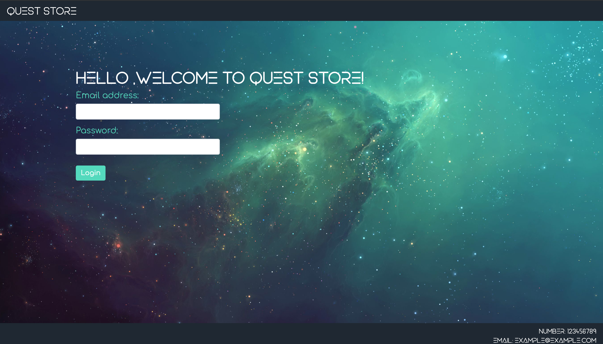

# QuestStore

We present you our take on Codecool management system. Our app is dedicated to provide various tools to help mentors and students throughout whole course.
# Admin tools:
- manage mentors
- manage classes
- manage levels of experience
# Mentor tools:
- manage students
- manage quests and rewards
# Student tools:
- Earn coolcoins and spend them on various rewards
- Follow your progress
- update your profile

# Learning goals:
- web development basics
- PostgresSQL
- remote database with ElephantSQL
- HTML/CSS/JS
- JTwig template engine
- working with agile methodology

# How to run an app:
1. Clone this repo on your machine
2. Enter following command in terminal: pg_restore -C -d [path_to_createDB file downloaded with repo]
3. Run main.java and go to localhost:8000/login (preferrably in Chrome)
Login on one of following accounts:
- Admin
  login: admin@codecool.com
  password: admin
  
- Mentor
  login: mentor4@codecool.com
  password: pass
  
- Student
  login: kamil@demo
  password: 123
